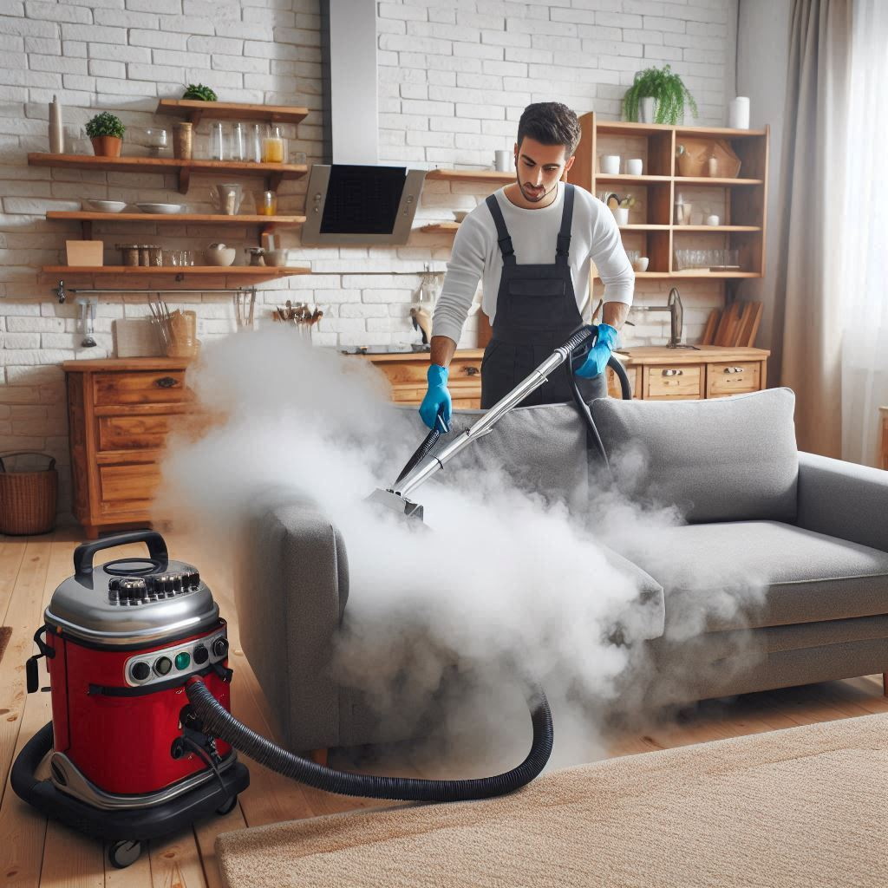

# Bootcamp-Microsoft-Copilot-Entrega-de-projeto

Entrega de projeto, final do Bootcamp Microsoft Pilot 2024

Plano de Negócios para Empresa de Limpeza de Estofados

Um plano de negócios é um documento que descreve os objetivos de um empreendimento e os passos necessários para alcançá-los. 
Um plano de negócios bem feito, baseado em uma boa metodologia, pode reduzir os riscos e aumentar as chances de sucesso do negócio. Ele permite identificar e restringir erros no papel, ao invés de cometê-los no mercado.

1. Apresentação de Negócio
Descrição da empresa: A AMR Clean é especializada em serviços de limpeza de estofados, oferecendo soluções de alta qualidade para residências e empresas.
Missão: Proporcionar ambientes mais limpos e saudáveis através de serviços de limpeza de estofados eficientes e sustentáveis.
Visão: Ser referência no mercado de limpeza de estofados, reconhecida pela excelência e inovação.
Valores: Qualidade, confiança, sustentabilidade e atendimento ao cliente.
Contato: [Telefone da Empresa], [Email da Empresa], [Endereço da Empresa]

2. Mercado
Análise de mercado: O mercado de limpeza de estofados está em crescimento, com demanda constante devido à necessidade de manutenção de móveis e estofados.
Público-alvo: Residências, escritórios, hotéis, restaurantes e clínicas.
Concorrência: Empresas locais de limpeza e serviços autônomos.
Tendências de mercado: Aumento da conscientização sobre higiene e saúde, e preferência por serviços sustentáveis.

3. Localização
Escolha do ponto comercial: Preferencialmente em áreas residenciais ou comerciais de fácil acesso.
Vantagens e desvantagens da localização: Proximidade dos clientes e fornecedores, custo do aluguel.
Acessibilidade: Facilidade de acesso para clientes e estacionamento.

4. Exigências Legais e Específicas
Registro da empresa: Registro como MEI (Microempreendedor Individual) ou outra forma jurídica adequada.
Licenças e alvarás: Licença sanitária, alvará de funcionamento e outras exigências locais.
Normas de segurança e higiene: Cumprimento das normas de segurança do trabalho e higiene.
5. Estrutura Pessoal
Organograma: Estrutura hierárquica com funções definidas.
Funções e responsabilidades: Descrição das funções de cada cargo, como gerentes, técnicos de limpeza e atendimento ao cliente.
Recrutamento e seleção: Processo de contratação e seleção de funcionários qualificados.

6. Equipamentos
Lista de equipamentos necessários: Máquinas de limpeza a vapor, aspiradores de pó, extratoras, produtos de limpeza específicos.
Fornecedores: Identificação de fornecedores confiáveis para equipamentos e produtos.
Manutenção e reposição: Plano de manutenção regular e reposição de equipamentos.

7. Matéria Prima/Mercadoria
Produtos de limpeza: Produtos específicos para diferentes tipos de estofados.
Fornecedores: Lista de fornecedores de produtos de limpeza.
Controle de estoque: Sistema de controle de estoque para evitar falta de produtos.

8. Organização do Processo Produtivo
Fluxo de trabalho: Passo a passo do processo de limpeza, desde a avaliação inicial até a finalização do serviço.
Métodos de limpeza: Técnicas de limpeza a seco, a vapor e outras.
Controle de qualidade: Procedimentos para garantir a qualidade do serviço prestado.

9. Automação
Ferramentas e softwares de gestão: Utilização de softwares para agendamento, controle de estoque e gestão financeira.
Benefícios da automação: Aumento da eficiência e redução de erros.
Implementação: Passos para implementar a automação na empresa.

10. Canais de Distribuição
Estratégias de distribuição: Atendimento a domicílio e parcerias com empresas.
Parcerias e contratos: Acordos com empresas de móveis, hotéis e escritórios.
Logística: Planejamento logístico para otimizar o atendimento.

11. Investimentos
Investimento inicial: Capital necessário para compra de equipamentos, produtos e marketing. Estima-se um investimento inicial a partir de R$4 mil reais.
Fontes de financiamento: Linhas de crédito, investidores e programas de incentivo.
Planejamento de expansão: Estratégias para crescimento e expansão do negócio.

12. Capital de Giro
Necessidade de capital de giro: Quantia necessária para manter a operação diária.
Gestão de caixa: Controle do fluxo de caixa para garantir a saúde financeira.
Fontes de capital de giro: Opções de financiamento para capital de giro.

13. Custos
Custos fixos e variáveis: Identificação dos custos fixos (aluguel, salários) e variáveis (produtos de limpeza, manutenção).
Análise de custos: Avaliação detalhada dos custos operacionais.
Redução de custos: Estratégias para otimizar e reduzir custos.

14. Diversificação/Agregação de Valor
Novos serviços: Introdução de serviços adicionais, como impermeabilização de estofados.
Diferenciação no mercado: Oferecer serviços exclusivos e personalizados.
Valor agregado: Adição de valor através de atendimento de qualidade e garantia de satisfação.

15. Divulgação
Estratégias de marketing: Campanhas de marketing digital, panfletagem e parcerias.
Publicidade e propaganda: Anúncios em mídias locais e online.
Redes sociais: Utilização de redes sociais para promover os serviços e interagir com clientes.

16. Informações Fiscais e Tributárias
Regime tributário: Escolha do regime tributário mais adequado (Simples Nacional, MEI).
Obrigações fiscais: Pagamento de impostos e contribuições.
Planejamento tributário: Estratégias para otimização fiscal.

17. Eventos
Participação em feiras e eventos: Participação em eventos do setor para networking e divulgação.
Networking: Construção de uma rede de contatos profissionais.
Promoções e campanhas: Promoções para atrair novos clientes e fidelizar os existentes.

18. Entidades em Geral
Associações e sindicatos: Participação em associações e sindicatos do setor.
Parcerias estratégicas: Colaborações com outras empresas e instituições.
Apoio institucional: Apoio de entidades governamentais e privadas.

19. Normas Técnicas Glossário
Normas técnicas aplicáveis: Cumprimento das normas técnicas de limpeza.
Termos e definições: Glossário de termos técnicos utilizados no setor.
Referências normativas: Documentos normativos relevantes.
20. Dicas de Negócio
Melhores práticas: Práticas recomendadas para o sucesso do negócio.
Casos de sucesso: Exemplos de empresas bem-sucedidas no setor.
Conselhos de especialistas: Dicas de especialistas para melhorar a operação.

21. Características Específicas do Empreendedor
Perfil do empreendedor: Características desejáveis para o empreendedor no setor de limpeza.
Competências e habilidades: Habilidades necessárias para gerir o negócio.
Desenvolvimento pessoal: Estratégias para desenvolvimento pessoal e profissional.

22. Bibliografia Complementar
Livros e artigos recomendados: Leituras recomendadas para aprofundamento no tema.
Sites e blogs especializados: Fontes de informação online.
Cursos e treinamentos: Formação complementar para o empreendedor e equipe.

23. Fonte de Recurso
Linhas de crédito: Opções de crédito disponíveis para o negócio.
Investidores: Como atrair investidores para o negócio.
Programas de incentivo: Programas de apoio ao empreendedorismo.

24. Planejamento Financeiro
Projeções financeiras: Projeções de receitas e despesas para os primeiros anos.
Análise de viabilidade: Avaliação da viabilidade econômica do negócio.
Indicadores financeiros: Indicadores para monitorar a saúde financeira da empresa.

--- 
> Attachments
> 
> 
> 
> 
> 
> [amrclean.pdf](output/amrclean.pdf)
> [planodenegocios.pdf](output/planodenegocios.pdf)
> 
---
